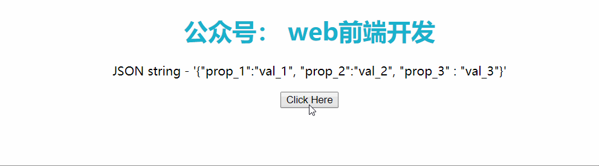
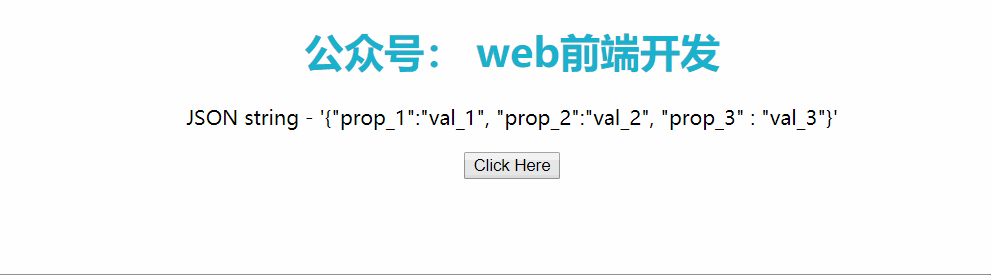

### JavaScript 知识点

#### JS 技巧方法

##### 一、8 个简单的 js 字符串方法

1. Length
   length 属性返回字符串中包含空格字符串在内的字符总数。

   ```js
   const str = "Hello World";
   str.length;
   // returns "11"
   ```

2. Slice()
   slice() 方法提取字符串的一部分，并将提取的部分返回到新字符串中（索引从零开始）。

   ```js
   const str = "Hello World";
   str.slice(2, 5);
   // returns "llo"
   ```

3. Replace()
   replace() 方法将指定的值替换为字符串中的另一个值。

   ```js
   const str = "YouAreAwesome";
   str.replace("Awesome", "Beautiful");
   // returns "YouAreBeautiful"
   ```

4. ToUpperCase() 和 ToLowerCase()
   toUpperCase() 和 toLowerCase() 是用于将字符串转换为大写或小写的方法。

   ```js
   const name = "Shelby";
   name.toUpperCase();
   // returns "SHELBY"
   name.toLowerCase();
   // returns "shelby"
   ```

5. Concat()
   concat() 方法用于连接两个或多个字符串。

   ```js
   const str = "Tim";
   str.concat("IsAwesome");
   // returns "TimIsAwesome"
   ```

6. Trim()
   trim() 方法用于删除字符串两侧的空白。

   ```js
   const str = "    JavaScriptIsHard    ";
   str.trim();
   // returns "JavaScriptIsHard"
   ```

7. Charat()
   charat() 方法返回字符串中指定索引处的字符。

   ```js
   const best = "JavaScript";
   best.charAt(6);
   // returns "r"
   ```

8. Split()
   split() 方法将字符串转换为数组（方法内须传递一个字符，如不传递则按每个字符分割）。

   ```js
   const msg = "Eight,Methods,Are,Done";
   msg.split(",");
   // returns the array ["Eight", "Methods", "Are", "Done"]
   ```

##### 二、8 个简单的 js 数学方法

1. ToString()
   tostring() 方法是将数字作为字符串返回（若提供参数 2、8、16，则返回二进制、八进制和十六进制的值）。

   ```js
   const num = 123;
   num.toString（）;
   // returns "123"
   （100 + 44）.toString（）;
   // returns "144"
   ```

2. ToExponential()
   toExponential() 方法返回一个字符串，其字符串使用指数表示法四舍五入并写入。该参数是可选的。整数形式，取值范围是 0 到 20，表示小数点后的位数。如果未提供任何内容，则将其设置为表示该值所需的任意位数。

   ```js
   const num = 3.414;
   num.toExponential（2）;
   // returns "3.414e + 0"
   ```

3. ToFixed()
   toFixed() 方法返回一个字符串，其中包含写入的数字和指定的小数位数。这里参数也是可选的。它代表小数点后的位数。默认情况下，它设置为 0。

   ```js
   const num = 3.414;
   num.toFixed（0）;
   // returns "3"
   num.toFixed（2）;
   // returns "3.41"
   ```

4. ToPrecision()
   toPrecision() 方法返回一个字符串，该字符串具有指定长度的数字。

   ```js
   const num = 3.414;
   num.toPrecision（2）;
   // returns "3.4"
   ```

5. ValueOf()
   valueOf() 方法返回数字作为数字。

   ```js
   const num = 123;
   num.valueOf（）;
   // returns "123"
   ```

6. Number()
   Number() 方法可用于将 JavaScript 变量转换为数字。

   ```js
   Number(true); // returns "1"
   Number(false); // returns "0"
   Number("10"); // returns "10"
   Number("10.43"); // returns "10.43"
   Number("2,54"); // returns "NaN"
   ```

7. ParseInt()
   parseInt() 方法解析一个字符串并返回一个整数。允许有空格。仅返回第一个数字。

   ```js
   parseInt("10"); // returns "10"
   parseInt("10.43"); // returns "10"
   parseInt("10 20 30"); // returns "10"
   parseInt("1000 cupcakes"); // returns "1000 & not delicious cupcakes"
   parseInt("dogs 1000"); // returns "NaN"
   ```

8. ParseFloat()
   parseFloat() 方法解析一个字符串并返回一个数字。允许有空格。仅返回第一个数字。

   ```js
   parseFloat("10"); // returns "10"
   parseFloat("10.43"); // returns "10.43"
   parseFloat("10 20 30"); // returns "10"
   parseFloat("1000 dogs"); // returns "1000"
   parseFloat("dogs 1000"); // returns "NaN"
   ```

##### 三、9 个功能强大的 js 技巧

1. 全部替换
   我们知道 string.replace() 函数仅替换第一次出现的情况。
   你可以通过在正则表达式的末尾添加 /g 来替换所有出现的内容。

   ```js
   var example = "potato potato";
   console.log(example.replace(/pot/, "tom"));
   // "tomato potato"
   console.log(example.replace(/pot/g, "tom"));
   // "tomato tomato"
   ```

2. 提取唯一值
   通过使用 Set 对象和展开对象符，我们可以创建一个具有唯一值的新数组。

   ```js
   var entries = [1, 2, 2, 3, 4, 5, 6, 6, 7, 7, 8, 4, 2, 1];
   var unique_entries = [...new Set(entries)];
   console.log(unique_entries);
   // [1, 2, 3, 4, 5, 6, 7, 8]
   ```

3. 将数字转换为字符串
   我们只需要使用带空引号的串联运算符。

   ```js
   var converted_number = 5 + "";
   console.log(converted_number);
   // 5
   console.log(typeof converted_number);
   // string
   ```

4. 将字符串转换为数字
   我们只需要使用 + 运算符。（注：它仅适用于“字符串数字”）

   ```js
   the_string = "123";
   console.log(+the_string);
   // 123

   the_string = "hello";
   console.log(+the_string);
   // NaN
   ```

5. 随机排列数组中的元素
   利用 Math.random() 方法。

   ```js
   var my_list = [1, 2, 3, 4, 5, 6, 7, 8, 9];
   console.log(
     my_list.sort(function () {
       return Math.random() - 0.5;
     })
   );
   // [4, 8, 2, 9, 1, 3, 6, 5, 7]
   ```

6. 展开二维数组
   只需要使用展开运算符。

   ```js
   var entries = [1, [2, 5], [6, 7], 9];
   var flat_entries = [].concat(...entries);
   // [1, 2, 5, 6, 7, 9]
   ```

7. 缩短条件语句
   让我们来看这个例子：

   ```js
   if (available) {
     addToCart();
   }
   ```

   通过简单地使用变量和函数来缩短它：

   ```js
   available && addToCart();
   ```

8. 动态属性名
   先声明一个对象，再分配动态属性。

   ```js
   const dynamic = "flavour";
   var item = {
     name: "Coke",
     [dynamic]: "Cherry",
   };
   console.log(item);
   // { name: "Coke", flavour: "Cherry" }
   ```

9. 使用 length 调整/清空数组
   调整数组的大小：

   ```js
   var entries = [1, 2, 3, 4, 5, 6, 7];
   console.log(entries.length);
   // 7
   entries.length = 4;
   console.log(entries.length);
   // 4
   console.log(entries);
   // [1, 2, 3, 4]
   ```

   清空数组：

   ```js
   var entries = [1, 2, 3, 4, 5, 6, 7];
   console.log(entries.length);
   // 7
   entries.length = 0;
   console.log(entries.length);
   // 0
   console.log(entries);
   // []
   ```

#### JS 代码片段

##### 一、63 个常用代码片段汇总

**1. all**
如果数组所有元素满足函数条件，则返回 true。调用时，如果省略第二个参数，则默认传递布尔值。

```js
const all = (arr, fn = Boolean) => arr.every(fn);

all([4, 2, 3], (x) => x > 1); // true
all([1, 2, 3]); // true
```

**2. allEqual**
判断数组元素是否都相等。

```js
const allEqual = (arr) => arr.every((val) => val === arr[0]);

allEqual([1, 2, 3, 4, 5, 6]); // false
allEqual([1, 1, 1, 1]); // true
```

**3. approximatelyEqual**
此代码示例检查两个数字是否近似相等，差异值可以通过传参的形式进行设置。

```js
const approximatelyEqual = (v1, v2, epsilon = 0, 001) =>
  Math.abs(v1 - v2) < epsilon;

appromimatelyEqual(Math.PI / 2, 0, 1.5708); // true
```

**4. arrayToCSV**
此段代码将没有逗号或双引号的元素转换成带有逗号分隔符的字符串即 CSV 格式识别的形式。

```js
const arrayToCSV = (arr, delimiter = ",") =>
  arr.map((v) => v.map((x) => `"${x}"`).join(delimiter)).join("\n");

arrayToCSV([
  ["a", "b"],
  ["c", "d"],
]); // '"a","b"\n"c","d"'
arrayToCSV(
  [
    ["a", "b"],
    ["c", "d"],
  ],
  ";"
); // '"a";"b"\n"c";"d"'
```

**5. arrayTohtmlList**
此段代码将数组元素转换城<li>标记，并将此元素添加至给定的 ID 元素标记内。

```js
const arrayTohtmlList = (arr, listID) =>
  ((el) => (
    (el = document.querySelector("#" + listID)),
    (el.innerHTML += arr.map((item) => `<li>${item}</li>`).join(""))
  ))();

arrayToHtmlList(["item 1", "item 2"], "myListID");
```

**6. attempt**
此段代码执行一个函数，将剩余的参数传回函数当参数，返回相应的结果，并能捕获异常。

```js
const attempt = (fn, ...args) => {
  try {
    return fn(...args);
  } catch (e) {
    return e instanceof Error ? e : new Error(e);
  }
};
var elements = attempt(function (selector) {
  return document.querySelectorAll(selector);
}, ">_>");
if (elements instanceof Error) elements = []; // elements = []
```

**7. average**
此段代码返回两个或多个数的平均数。

```js
const average = (...nums) =>
  nums.reduce((acc, val) => acc + val, 0) / nums.length;
average(...[1, 2, 3]); // 2
average(1, 2, 3); // 2
```

**8. averageBy**
一个 map()函数和 reduce()函数结合的例子，此函数先通过 map() 函数将对象转换成数组，然后在调用 reduce()函数进行累加，然后根据数组长度返回平均值。

```js
const averageBy = (arr, fn) =>
  arr
    .map(typeof fn === "function" ? fn : (val) => val[fn])
    .reduce((acc, val) => acc + val, 0) / arr.length;

averageBy([{ n: 4 }, { n: 2 }, { n: 8 }, { n: 6 }], (o) => o.n); // 5
averageBy([{ n: 4 }, { n: 2 }, { n: 8 }, { n: 6 }], "n"); // 5
```

**9. bifurcate**
此函数包含两个参数，类型都为数组，依据第二个参数的真假条件，将一个参数的数组进行分组，条件为真的放入第一个数组，其它的放入第二个数组。这里运用了 Array.prototype.reduce() 和 Array.prototype.push() 相结合的形式。

```js
const bifurcate = (arr, filter) =>
  arr.reduce((acc, val, i) => (acc[filter[i] ? 0 : 1].push(val), acc), [
    [],
    [],
  ]);
bifurcate(["beep", "boop", "foo", "bar"], [true, true, false, true]);
// [ ['beep', 'boop', 'bar'], ['foo'] ]
```

**10. bifurcateBy**
此段代码将数组按照指定的函数逻辑进行分组，满足函数条件的逻辑为真，放入第一个数组中，其它不满足的放入第二个数组 。这里运用了 Array.prototype.reduce() 和 Array.prototype.push() 相结合的形式，基于函数过滤逻辑，通过 Array.prototype.push() 函数将其添加到数组中。

```js
const bifurcateBy = (arr, fn) =>
  arr.reduce((acc, val, i) => (acc[fn(val, i) ? 0 : 1].push(val), acc), [
    [],
    [],
  ]);

bifurcateBy(["beep", "boop", "foo", "bar"], (x) => x[0] === "b");
// [ ['beep', 'boop', 'bar'], ['foo'] ]
```

**11. bottomVisible**
用于检测页面是否滚动到页面底部。

```js
const bottomVisible = () =>
  document.documentElement.clientHeight + window.scrollY >=
  (document.documentElement.scrollHeight ||
    document.documentElement.clientHeight);

bottomVisible(); // true
```

**12. byteSize**
此代码返回字符串的字节长度。这里用到了 Blob 对象，Blob（Binary Large Object）对象代表了一段二进制数据，提供了一系列操作接口。其他操作二进制数据的 API（比如 File 对象），都是建立在 Blob 对象基础上的，继承了它的属性和方法。生成 Blob 对象有两种方法：一种是使用 Blob 构造函数，另一种是对现有的 Blob 对象使用 slice 方法切出一部分。

```js
const byteSize = (str) => new Blob([str]).size;
byteSize(""); // 4
byteSize("Hello World"); // 11
```

**13. capitalize**
将字符串的首字母转成大写,这里主要运用到了 ES6 的展开语法在数组中的运用。

```js
const capitalize = ([first, ...rest]) => first.toUpperCase() + rest.join("");

capitalize("fooBar"); // 'FooBar'
capitalize("fooBar", true); // 'FooBar'
```

**14. capitalizeEveryWord**
将一个句子中每个单词首字母转换成大写字母，这里中要运用了正则表达式进行替换。

```js
const capitalizeEveryWord = (str) =>
  str.replace(/\b[a-z]/g, (char) => char.toUpperCase());

capitalizeEveryWord("hello world!"); // 'Hello World!'
```

**15. castArray**
此段代码将非数值的值转换成数组对象。

```js
const castArray = (val) => (Array.isArray(val) ? val : [val]);

castArray("foo"); // ['foo']
castArray([1]); // [1]
```

**16. compact**
将数组中移除值为 false 的内容。

```js
const compact = (arr) => arr.filter(Boolean);

compact([0, 1, false, 2, "", 3, "a", "e" * 23, NaN, "s", 34]);
// [ 1, 2, 3, 'a', 's', 34 ]
```

**17. countOccurrences**
统计数组中某个值出现的次数

```js
const countOccurrences = (arr, val) =>
  arr.reduce((a, v) => (v === val ? a + 1 : a), 0);
countOccurrences([1, 1, 2, 1, 2, 3], 1); // 3
```

**18. Create Directory**
此代码段使用 existSync() 检查目录是否存在，然后使用 mkdirSync() 创建目录（如果不存在）。

```js
const fs = require("fs");
const createDirIfNotExists = (dir) =>
  !fs.existsSync(dir) ? fs.mkdirSync(dir) : undefined;
createDirIfNotExists("test");
// creates the directory 'test', if it doesn't exist
```

**19. currentURL**
返回当前访问的 URL 地址。

```js
const currentURL = () => window.location.href;

currentURL(); // 'https://medium.com/@fatosmorina'
```

**20. dayOfYear**
返回当前是今年的第几天

```js
const dayOfYear = (date) =>
  Math.floor((date - new Date(date.getFullYear(), 0, 0)) / 1000 / 60 / 60 / 24);

dayOfYear(new Date()); // 272
```

**21. decapitalize**
将字符串的首字母转换为小写字母

```js
const decapitalize = ([first, ...rest]) => first.toLowerCase() + rest.join("");

decapitalize("FooBar"); // 'foobar'
```

**22. deepFlatten**
通过递归的形式，将多维数组展平成一堆数组。

```js
const deepFlatten = (arr) =>
  [].concat(...arr.map((v) => (Array.isArray(v) ? deepFlatten(v) : v)));

deepFlatten([1, [2], [[3], 4], 5]); // [1, 2, 3, 4, 5]
```

**23. default**
去重对象的属性，如果对象中含有重复的属性，以前面的为准。

```js
const defaults = (obj, ...defs) =>
  Object.assign({}, obj, ...defs, reverse(), obj);

defaults({ a: 1 }, { b: 2 }, { b: 6 }, { a: 3 }); // {a: 1, b: 2}
```

**24. defer**
延迟函数的调用，即异步调用函数。

```js
const defer = (fn, ...args) => setTimeout(fn, 1, ...args);

defer(console.log, "a"), console.log("b"); // Logs 'b' then 'a'
```

**25. degreesToRads**
此段代码将标准的度数，转换为弧度。

```js
const degreesToRads = (deg) => (deg * Math.PI) / 180.0;

degreesToRads(90.0); // ~1.5708
```

**26. difference**

```js
const difference = (a, b) => {
  const s = new Set(b);
  return a.filter((x) => !s.has(x));
};

difference([1, 2, 3], [1, 2, 4]); // [3]
```

**27. differenceBy**
通过给定的函数来处理需要对比差异的数组，查找出前数组在后数组中的不存在元素。

```js
const differenceBy = (a, b, fn) => {
  const s = new Set(b.map(fn));
  return a.filter((x) => !s.has(fn(x)));
};

differenceBy([2.1, 1.2], [2.3, 3.4], Math.floor); // [1.2]
differenceBy([{ x: 2 }, { x: 1 }], [{ x: 1 }], (v) => v.x); // [{ x: 2}]
```

**28. differenceWith**
此段代码按照给定函数逻辑筛选需要对比差异的数组，查找出前数组在后数组中的不存在元素。

```js
const differnceWith = (arr, val, comp) =>
  arr.filter((a) => val.findIndex((b) => comp(a, b)) === -1);

differenceWith(
  [1, 1.2, 1.5, 3, 0],
  [1.9, 3, 0],
  (a, b) => Math.round(a) === Math.round(b)
); // [1, 1.2]
```

**29. digitize**
将输入的数字拆分为单个数字组成的数组。

```js
const digitize = (n) => [...`${n}`].map((i) => parseInt[i]);

digitize(431); // [4, 3, 1]
```

**30. distance**
计算两点之间的距离。

```js
const distance = (x0, y0, x1, y1) => Math.hypot(x1 - x0, y1 - y0);

distance(1, 1, 2, 3); // 2.23606797749979
```

**31. drop**
将给定的数组从左边开始删除 n 个元素。

```js
const drop = (arr, n = 1) => arr.slice(n);

drop([1, 2, 3]); // [2, 3]
drop([1, 2, 3], 2); // [3]
drop([1, 2, 3], 42); // []
```

**32. dropRight**
将给定的数组从右边开始删除 n 个元素。

```js
const dropRight = (arr, n = 1) => arr.slice(0, -n);

dropRight([1, 2, 3]); // [1,2]
dropRight([1, 2, 3], 2); // [1]
dropRight([1, 2, 3], 42); // []
```

**33. dorpRightWhile**
将给定的数组按照给定的函数条件从右开始删除，直到当前元素满足函数条件为 True 时，停止删除，并返回数组剩余元素。

```js
const dropRightWhile = (arr, func) => {
  while (arr.length > 0 && !func(arr[arr.length - 1])) arr = arr.slice(0, -1);
  return arr
};

dropRightWhile([1,2,3,4], n => n<3>); // [1, 2]
```

**34. dropWhile**
按照给定的函数条件筛选数组，不满足函数条件的将从数组中移除。

```js
const dropWhile = (arr, func) => {
  while (arr.length > 0 && !func(arr[0])) arr = arr.slice(1);
  return arr;
};

dropWhile([1, 2, 3, 4], (n) => n >= 3); // [3, 4]
```

**35. elementContains**
接受两个 DOM 元素对象参数，判断后者是否是前者的子元素。

```js
const elemntContains = (parent, child) =>
  parent !== child && parent.contains(child);

elementContains(
  document.querySelector("head"),
  document.querySelector("title")
); // true
elementContains(document.querySelector("body"), document.queryselector("body")); // false
```

**36. filterNonUnique**
移除数组中重复的元素。

```js
const filterNonUnique = (arr) => [...new Set(arr)];

filterNonUnique([1, 2, 2, 3, 4, 4, 5]); // [1, 2, 3, 4, 5]
```

**37. findKey**
按照给定的函数条件，查找第一个满足条件对象的键值。

```js
const findKey = (obj, fn) =>
  Object.keys(obj).find((key) => fn(obj[key], key, obj));

findKey(
  {
    barney: { age: 36, active: true },
    fred: { age: 40, active: false },
    pebbles: { age: 1, active: true },
  },
  (o) => o["active"]
); // 'barney'
```

**38. findLast**
按照给定的函数条件筛选数组，将最后一个满足条件的元素进行删除。

```js
const findLast = [arr, fn] => arr.filter(fn).pop();

findLast([1, 2, 3, 4], n => n % 2 === 1); // 3
```

**39. flatten**
按照指定数组的深度，将嵌套数组进行展平。

```js
const flatten = (arr, depth = 1) =>
  arr.reduce(
    (a, v) =>
      a.concat(depth > 1 && Array.isArray(v) ? flatten(v, depth - 1) : v),
    []
  );

flatten([1, [2], 3, 4]); // [1, 2, 3, 4]
flatten([1, [2, [3, [4, 5], 6], 7], 8], 2); // [1, 2, 3, [4, 5], 6, 7, 8]
```

**40. forEachRight**
按照给定的函数条件，从数组的右边往左依次进行执行。

```js
const forEachRight = (arr, callback) =>
  arr.slice(0).reverse().forEach(callback);

forEachRight([1, 2, 3, 4], (val) => console.log(val)); // '4', '3', '2', '1'
```

#### JS 相关问题

##### 一、如何将 JavaScript 中的 JSON 字符串转换为 JSON 对象数组？

**方法一**
首先使用 JSON.Parse（）方法将 JSON 字符串转换为 JavaScript 对象，然后取出对象的值，然后使用 push（）方法将其推入数组。

```js
<!DOCTYPE HTML>
<html>
<head>
 <title>
     将JSON字符串转换为JSON对象数组
 </title>
</head>
<body style = "text-align:center;">
 <h1 style = "color:#1ab1cc;" >
   公众号：web前端开发
 </h1>
 <p id = "GFG_UP"></p>
 <button onclick = "myGFG()">
     Click Here
 </button>
 <p id = "GFG_DOWN"></p>
 <script>
     var up = document.getElementById("GFG_UP");
     var JS_Obj =
     '{"prop_1":"val_1", "prop_2":"val_2", "prop_3" : "val_3"}';

     up.innerHTML = "JSON string - '" + JS_Obj + "'";

     var down = document.getElementById("GFG_DOWN");

     function myGFG() {
         var obj = JSON.parse(JS_Obj);
         var res = [];

         for(var i in obj)
             res.push(obj[i]);

         down.innerHTML = "Array of values - ["
                         + res + "]";
     }
</script>
</body>
</html>
```

输出结果截图如下：


**方法二**
方法二使用 eval（）方法将 JSON 字符串转换为 JavaScript 对象，然后取出对象的值，然后使用 push（）方法将其推入数组。

```js
<!DOCTYPE HTML>
<html>

<head>
   <title>
         将JSON字符串转换为JSON对象数组
   </title>
</head>

<body style = "text-align:center;">

   <h1 style = "color:#1ab1cc;" >
      公众号：web前端开发
   </h1>

   <p id = "GFG_UP"></p>

   <button onclick = "myGFG()">
      Click Here
   </button>

   <p id = "GFG_DOWN"></p>

   <script>
      var up = document.getElementById("GFG_UP");

      var JS_Obj =
      '{"prop_1":"val_1", "prop_2":"val_2", "prop_3" : "val_3"}';

      up.innerHTML = "JSON string - '" + JS_Obj + "'";

      var down = document.getElementById("GFG_DOWN");

      function myGFG() {
            var obj = eval('(' + JS_Obj + ')');
            var res = [];

            for(var i in obj)
               res.push(obj[i]);

            down.innerHTML = "Array of values - ["
                           + res + "]";
      }
</script>
</body>

</html>
```

输出结果截图如下：

